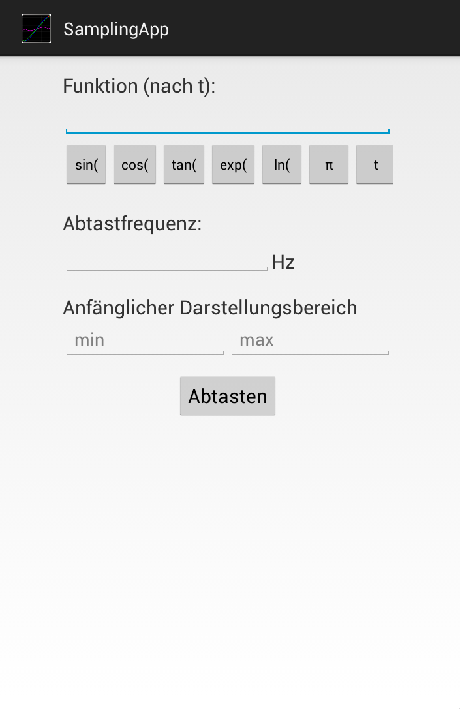
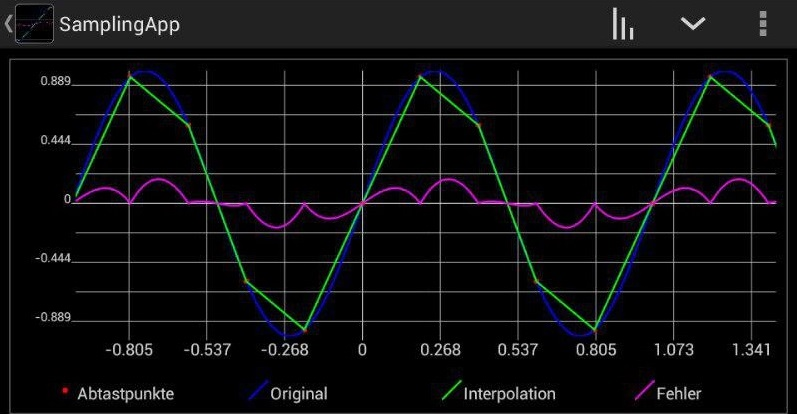

# Sampling App
Android app to sample a function and reconstruct it with different interpolations

## Abstract
A user can enter a function, a sampling frequency and view the output. The frequency spectrum and
the phase response can be viewed for both the original and the sampled signal. For reconstruction of the original signal with the sampled signal as 
the input, three interpolations are available: zero order, first order and si-interpolation.

## Installation
Either download and install the .apk (requires at least Android 4.1) in this repository or download the source code and embedd it in your 
own Android app.

## Screenshots
Main screen. A function is entered here

	

Frequency plot of sin(2\*Pi\*t) sampled with 5Hz, first order interpolation 

	

## Third party libraries
[Androidplot](http://androidplot.com/)